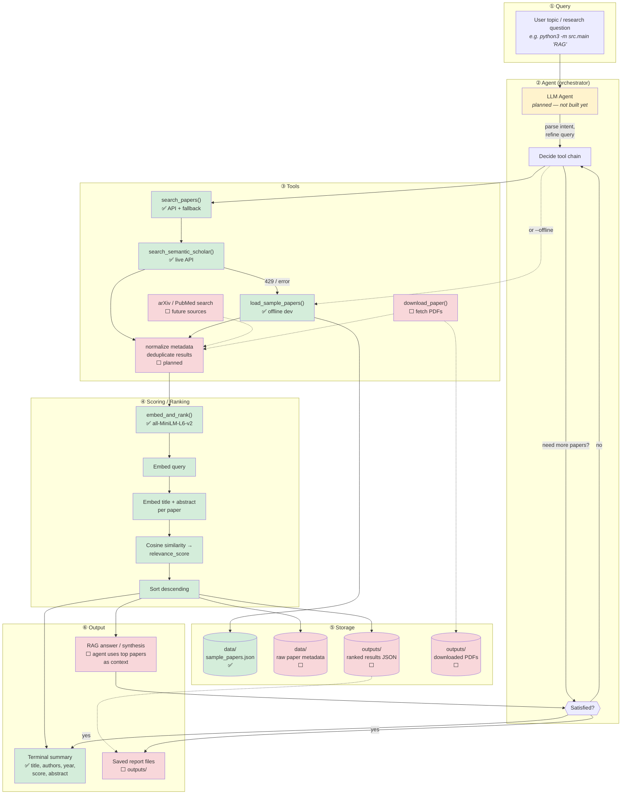

```mermaid
flowchart TD
    subgraph INPUT["① Query"]
        Q["User topic / research question<br/><i>e.g. python3 -m src.main 'RAG'</i>"]
    end

    subgraph AGENT["② Agent (orchestrator)"]
        A["LLM Agent<br/><i>planned — not built yet</i>"]
        A -->|"parse intent,<br/>refine query"| PLAN["Decide tool chain"]
        PLAN -->|"need more papers?"| LOOP{{"Satisfied?"}}
        LOOP -->|"no"| PLAN
    end

    subgraph TOOLS["③ Tools"]
        direction TB
        T1["search_semantic_scholar()<br/>✅ live API"]
        T2["load_sample_papers()<br/>✅ offline dev"]
        T3["search_papers()<br/>✅ API + fallback"]
        T4["download_paper()<br/>⬜ fetch PDFs"]
        T5["arXiv / PubMed search<br/>⬜ future sources"]
        TN["normalize metadata<br/>deduplicate results<br/>⬜ planned"]
    end

    subgraph SCORING["④ Scoring / Ranking"]
        E["embed_and_rank()<br/>✅ all-MiniLM-L6-v2"]
        E1["Embed query"]
        E2["Embed title + abstract<br/>per paper"]
        E3["Cosine similarity →<br/>relevance_score"]
        E4["Sort descending"]
        E --> E1
        E1 --> E2
        E2 --> E3
        E3 --> E4
    end

    subgraph STORAGE["⑤ Storage"]
        D1[("data/<br/>sample_papers.json<br/>✅")]
        D2[("data/<br/>raw paper metadata<br/>⬜")]
        D3[("outputs/<br/>ranked results JSON<br/>⬜")]
        D4[("outputs/<br/>downloaded PDFs<br/>⬜")]
    end

    subgraph OUTPUT["⑥ Output"]
        O1["Terminal summary<br/>✅ title, authors, year,<br/>score, abstract"]
        O2["Saved report files<br/>⬜ outputs/"]
        O3["RAG answer / synthesis<br/>⬜ agent uses top papers<br/>as context"]
    end

    Q --> A
    PLAN --> T3
    PLAN -.->|"or --offline"| T2
    T3 --> T1
    T1 -->|"429 / error"| T2
    T1 --> TN
    T2 --> TN
    T5 -.-> TN
    T4 -.-> TN
    TN --> E
    E4 --> D2
    E4 --> D3
    T4 -.-> D4
    T2 --> D1
    E4 --> O1
    D3 -.-> O2
    E4 --> O3
    O3 --> LOOP
    LOOP -->|"yes"| O1
    LOOP -->|"yes"| O2

    style T1 fill:#d4edda
    style T2 fill:#d4edda
    style T3 fill:#d4edda
    style E fill:#d4edda
    style E1 fill:#d4edda
    style E2 fill:#d4edda
    style E3 fill:#d4edda
    style E4 fill:#d4edda
    style D1 fill:#d4edda
    style O1 fill:#d4edda
    style A fill:#fff3cd
    style T4 fill:#f8d7da
    style T5 fill:#f8d7da
    style TN fill:#f8d7da
    style D2 fill:#f8d7da
    style D3 fill:#f8d7da
    style D4 fill:#f8d7da
    style O2 fill:#f8d7da
    style O3 fill:#f8d7da
```