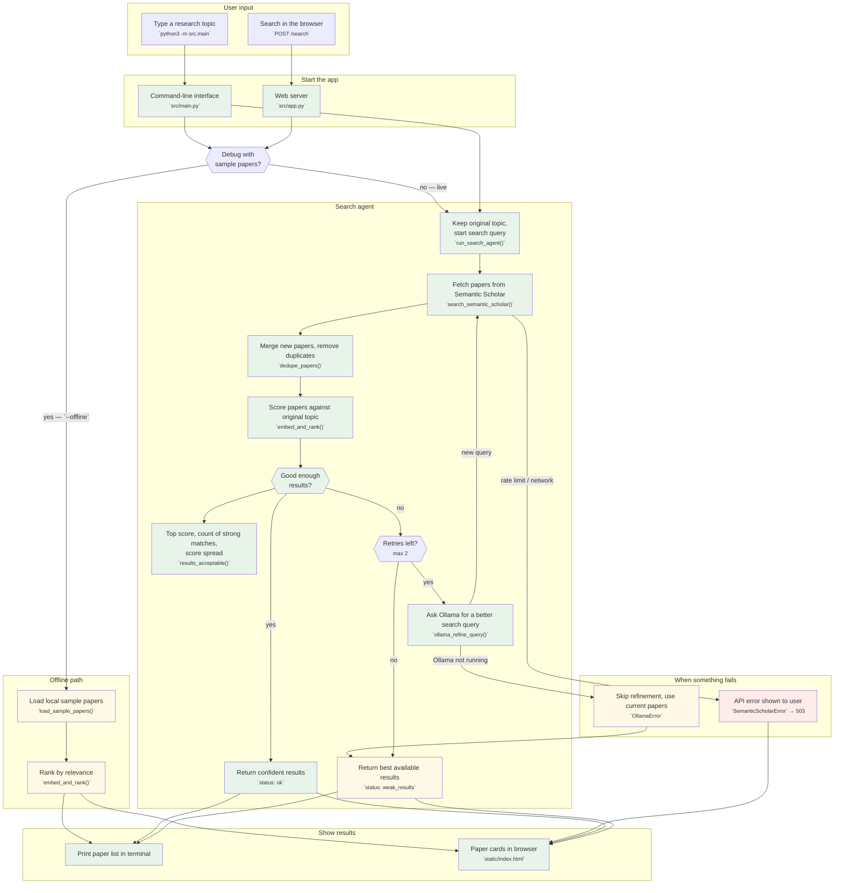

# Pipeline flowchart v1

Current system: search → score → optionally refine query with Ollama → show ranked papers.



## In plain English

1. **User** enters a topic via the terminal or web UI.
2. **Live path (default):** the agent searches Semantic Scholar, pools papers across attempts, and scores them against the **original** topic.
3. **Quality check:** if scores pass thresholds, return results. If not, Ollama suggests a refined search query (up to 2 times).
4. **Offline path:** only for debugging — loads `data/sample_papers.json`, no API, no agent loop.
5. **Errors:** API failures stop with an error message; Ollama failures skip refinement and return the best papers found so far.

## Agent loop

```
original topic (never changes)
    ↓
search online → merge & dedupe → score against original topic
    ↓
good enough? → yes → done
    ↓ no
Ollama rewrites search query → search again (max 2 rounds)
    ↓
return best ranked papers (top 8)
```
