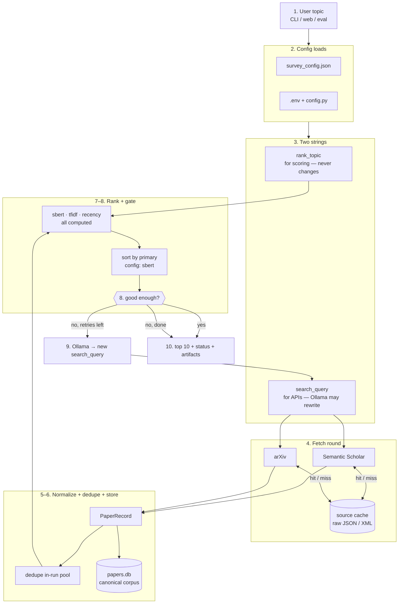

# Pipeline flowchart v3.1

Concise system walkthrough — retrieval baseline for continuous knowledge curation.

---

## One-sentence pitch

A **layered retrieval subsystem**: external APIs find candidate papers → we **integrate and persist** them into a canonical store → **re-rank** against the user's topic with multiple metrics → an optional **agent layer** rewrites search queries when results are weak.

Semantic Scholar and arXiv already do relevance matching at fetch time. Our job is **data integration + deduplication + re-ranking + adaptive query planning**.

---

## Flow (one diagram)



---

## How the system works

### 1. Entry and configuration

You type a topic, e.g. `python -m src.main "retrieval augmented generation"`.

The system loads:
- **`data/survey_config.json`** — sources, year window, max candidates, default `rank_method`
- **`src/config.py` + `.env`** — API keys, rate limits, quality-gate thresholds

### 2. Query planner starts (`run_search_agent`)

Two strings matter — they are **not always the same**:

| String | Purpose | Changes during run? |
|--------|---------|-------------------|
| `original_query` | What the user typed | Never |
| `rank_topic` | What we rank against | Only via acronym expansion (RAG → retrieval augmented generation) |
| `search_query` | What we send to SS + arXiv | Yes — Ollama can rewrite this |

**Invariant:** refinement changes how we **fetch**, not how we **score**.

### 3. Fetch round (`fetch_all_sources`)

For each page (up to 2 pages × 100 papers per source):

**Semantic Scholar**
- **In:** `query`, `limit=100`, `offset`, `year`, `fieldsOfStudy`
- **Out:** JSON list of raw papers
- **Cache:** `outputs/cache/semantic_scholar/{hash}.json`

**arXiv**
- **In:** `search_query=all:{query}`, `start`, `max_results=100`
- **Out:** Atom XML → parsed dicts
- **Cache:** `outputs/cache/arxiv/{hash}.json`

### 4. Normalize → canonical `PaperRecord`

Every raw record becomes the same shape (`src/schema.py`):

```
paper_id, title, authors, year, abstract, doi, arxiv_id, s2_paper_id,
pdf_url, venue, citation_count, sources[], source_queries[]
```

**Identity:** DOI → arXiv → S2 paperId → title fingerprint

### 5. Dedupe (three places)

1. **Within one fetch** — same `paper_id` from SS + arXiv → one record, `sources: ["semantic_scholar", "arxiv"]`
2. **Across agent rounds** — merge pool from round 0 + 1 + …
3. **Persistent DB** — upsert merges metadata if paper already exists

### 6. Store to main DB

Chunked upserts (50 per batch) into **`outputs/papers.db`**:
- `papers` — canonical corpus
- `source_hits` — which source, which query, when

This is the **long-lived knowledge base**. `outputs/history.db` is separate — web search session audit only.

### 7. Rank (`rank_papers`)

**In:** `rank_topic` + paper dicts (title + abstract)

**All three metrics computed:**

| Metric | What it uses | Output key |
|--------|--------------|------------|
| SBERT | `all-MiniLM-L6-v2` cosine on title+abstract | `sbert_cosine` |
| TF-IDF | sklearn cosine on title+abstract | `tfidf_cosine` |
| Recency | year within timeline | `recency` |

**Out per paper:** `scores`, `rank_method`, `relevance_score` — list sorted by `relevance_score` (= primary method).

### 8. Quality gate (`results_acceptable`)

Uses **only** `relevance_score`. Pass when:
- Top score ≥ **0.35**
- At least **3** papers ≥ **0.40**
- Top beats median-of-top-5 by ≥ **0.08**

### 9. Optional Ollama refinement

If gate fails and mode is `agent`:
- **In:** original topic, rejection reason, previous search query, top weak results
- **Out:** one new search string (3–8 words)
- Loop back to step 3 (max 2 refinements = 3 rounds total)

### 10. Return and persist

- Top **10** papers
- Status: `ok` | `weak_results` | `partial_success` | `failure`
- Artifacts → `outputs/runs/{run_id}/`
- Web only → `outputs/history.db`

---

## In one line

```
User topic → SS + arXiv (cached) → PaperRecord → papers.db
  → rank all metrics, sort by primary → gate → maybe Ollama rewrites search → top 10
```

---

## rank_topic vs search_query

| | **rank_topic** | **search_query** |
|---|----------------|------------------|
| **Used for** | Scoring (SBERT, TF-IDF, recency) | Semantic Scholar + arXiv fetch |
| **Changes?** | No (acronym expand only) | Yes — Ollama can rewrite |

---

## cache vs papers.db

| | **source cache** | **papers.db** |
|---|------------------|---------------|
| **Stores** | Raw API blobs (JSON / XML) | Normalized `PaperRecord` rows |
| **Key** | Hash of endpoint + params | `paper_id` (DOI → arXiv → S2 → fingerprint) |
| **Purpose** | Skip network on repeat queries | Long-lived deduped corpus |
| **Lifespan** | Until deleted; `--no-cache` bypasses | Grows across runs |

Third store: **`outputs/history.db`** — full web search sessions (audit/replay), not the paper corpus.

---

## Primary rank method

- **Configured** in `data/survey_config.json` → `"rank_method": "sbert"` (or `tfidf`, `recency`)
- **All metrics computed** every run; only primary sets sort order and quality gate
- **Best method chosen offline** via `python -m src.eval` — target-hit comparison, not auto-picked per query

---

## Agent modes (research baselines)

| Mode | What it tests |
|------|----------------|
| `single_fetch` | One search, no refinement — strong baseline |
| `multi_fetch_same` | Re-fetch same query — does pagination alone help? |
| `agent` | Ollama rewrites query when gate fails — does adaptation help? |

---

## Cheat sheet

```
rank_topic   = score against this (original topic)
search_query = fetch with this (Ollama may change)

fetch → normalize → dedupe → papers.db → rank → gate → [Ollama] → top 10
```

**Where things live:**
- `outputs/cache/` — raw API responses
- `outputs/papers.db` — canonical papers
- `outputs/history.db` — web sessions only
- `outputs/runs/` — per-search artifacts
