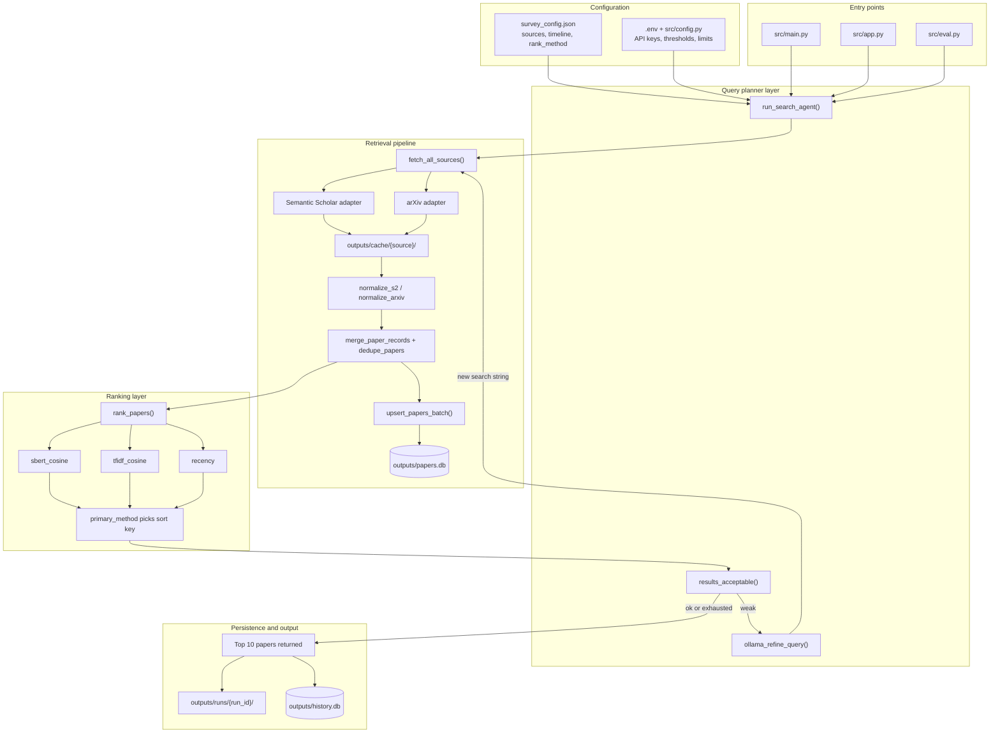
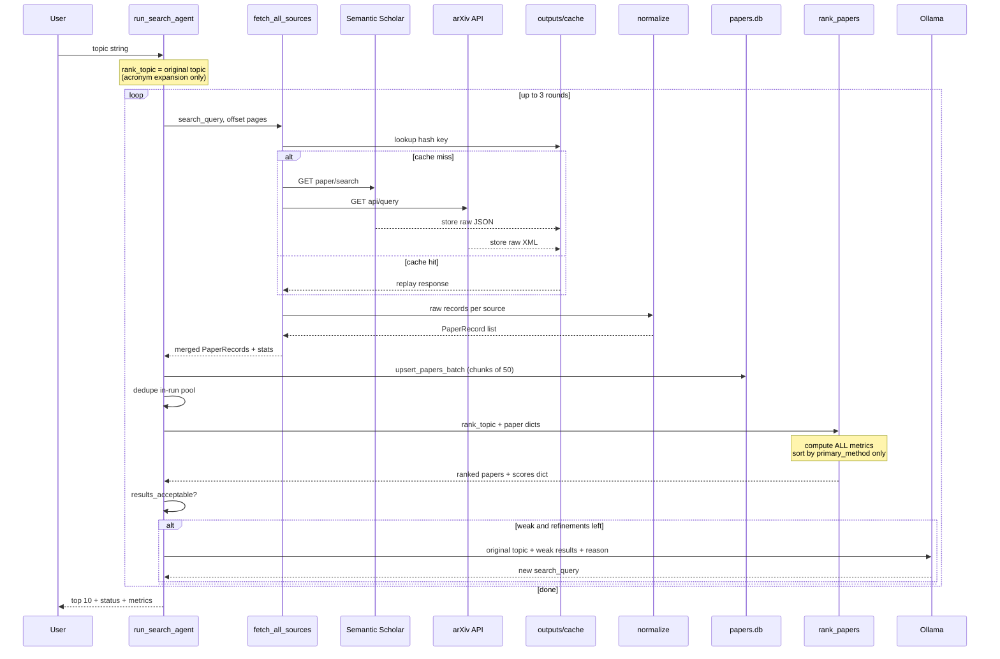
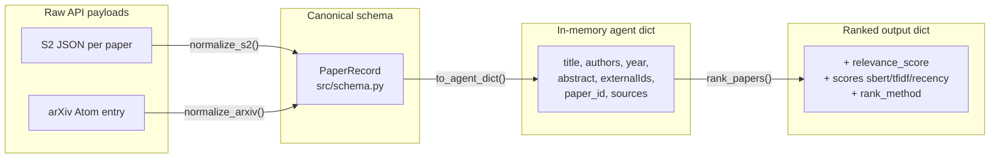
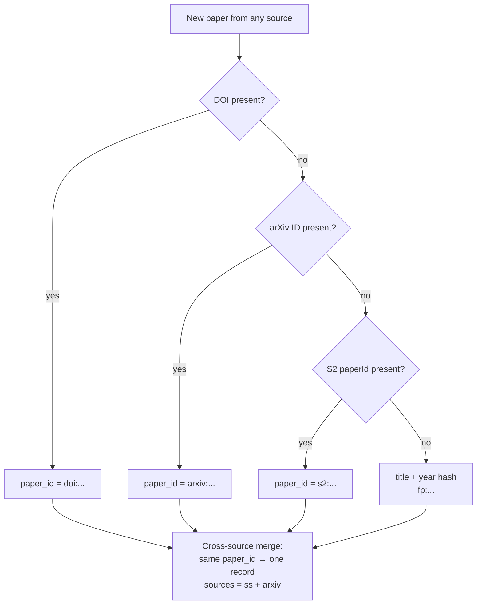
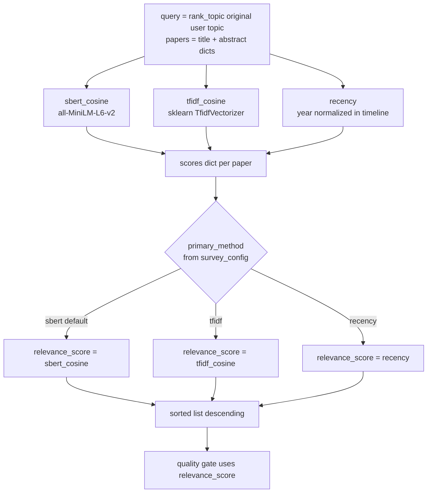

# Pipeline flowchart v3 — Retrieval Subsystem

Full layered architecture for continuous knowledge curation baseline.
See also: [flowchart_v2.md](flowchart_v2.md) (UI/agent loop focus).

---

## 1. System layers (bird's-eye)

---

## 2. One search round (live path)

---

## 3. Data transformation chain

---

## 4. Identity and deduplication

**Two dedupe stages:**
1. **Cross-source** (`merge_paper_records` in fetch): same `paper_id` within one fetch
2. **In-run pool** (`dedupe_papers` in agent): DOI → arXiv → title across rounds
3. **Persistent DB** (`upsert_papers_batch`): merge metadata on existing `paper_id`

---

## 5. Ranking: all metrics computed, one primary sorts

**Primary method is NOT auto-selected at runtime.** It is configured (`data/survey_config.json` → `rank_method`) or overridden (`--rank-method` in eval). Robustness is studied offline by comparing target-hit rates across methods in `src/eval.py`.

---

## 6. Storage tiers

| Tier | Path | What it stores | Lifetime |
|------|------|----------------|----------|
| Source cache | `outputs/cache/semantic_scholar/`, `outputs/cache/arxiv/` | Raw API responses keyed by hash(endpoint + params) | Until deleted; `--no-cache` bypasses |
| Main papers DB | `outputs/papers.db` | Canonical deduped `PaperRecord` rows + `source_hits` | Grows across runs |
| Search history | `outputs/history.db` | Full web search session JSON (audit/replay) | 60-day retention |
| Run artifacts | `outputs/runs/{run_id}/` | `result.json`, `rounds.json`, `metrics.json` | Per live CLI/web search |
| Eval batch | `outputs/eval/{timestamp}.json` | Benchmark comparison rows | Per eval run |

---

## 7. Stage I/O reference

### 7.1 Semantic Scholar adapter

| | |
|---|---|
| **Input** | `query` (search string), `limit`, `offset`, optional `year`, `fieldsOfStudy` |
| **HTTP** | `GET api.semanticscholar.org/graph/v1/paper/search` |
| **Raw output** | JSON `{total, offset, data: [{paperId, title, authors, year, abstract, externalIds, ...}]}` |
| **Normalized output** | `PaperRecord` via `normalize_s2()` |
| **Cache key** | `sha256(source + url + sorted params)` |

### 7.2 arXiv adapter

| | |
|---|---|
| **Input** | `query` → wrapped as `all:{query}`, `start`, `max_results` |
| **HTTP** | `GET export.arxiv.org/api/query` |
| **Raw output** | Atom XML feed with `<entry>` elements |
| **Normalized output** | `PaperRecord` via `normalize_arxiv()` |
| **Rate limit** | ~3 seconds between requests (polite use) |

### 7.3 `fetch_all_sources()`

| | |
|---|---|
| **Input** | `query: str`, `SurveyConfig`, optional `offset`, `limit` |
| **Output** | `(list[PaperRecord], FetchStats)` where FetchStats has `api_calls`, `cache_hits`, `api_calls_by_source`, `fetch_errors` |
| **Cap** | `max_candidates_per_run` (default 200) |

### 7.4 `rank_papers()`

| | |
|---|---|
| **Input** | `query` (always **original rank_topic**), `papers` (agent dicts with title + abstract), `methods`, `primary_method`, year window |
| **Output** | Same papers + `scores: {sbert_cosine, tfidf_cosine, recency}`, `rank_method`, `relevance_score` (from primary), sorted descending |
| **Quality gate input** | Uses `relevance_score` only (primary method) |

### 7.5 `run_search_agent()`

| | |
|---|---|
| **Input** | `original_query`, `mode` (agent / single_fetch / multi_fetch_same), `refine`, optional `rank_method`, `survey_config` |
| **Output** | `{query, mode, papers[top 10], status, rounds[], metrics, search_queries_used, rank_topic, ...}` |
| **Status** | `ok`, `weak_results`, `partial_success`, `failure` |

---

## 8. Agent modes (research baselines)

| Mode | Fetches | Ollama | Max rounds | Research question |
|------|---------|--------|------------|-------------------|
| `single_fetch` | 1 query, 2 pages/source | No | 1 | Strong one-shot baseline |
| `multi_fetch_same` | Same query re-fetched | No | 3 | Does pagination alone help? |
| `agent` | Adaptive query rewrite | Yes | 3 | Does LLM query refinement help? |

**Invariant:** ranking always uses `rank_topic` (original user topic). Only the **search string** sent to APIs changes after Ollama refinement.

---

## 9. Quality gate thresholds (`src/config.py`)

| Rule | Threshold | Meaning |
|------|-----------|---------|
| `SCORE_TOP_MIN` | 0.35 | Best paper must clear this |
| `SCORE_GOOD` | 0.40 | "Strong match" count |
| `MIN_GOOD_PAPERS` | 3 | Need ≥3 papers ≥ 0.40 |
| `MIN_SCORE_GAP` | 0.08 | Top score must beat median-of-top-5 by this margin |

If gate fails and refinements remain → Ollama produces a new search query.

---

## 10. What changed since v2

| Area | v2 | v3 |
|------|----|----|
| Diagram scope | UI + agent loop | Full retrieval stack with I/O contracts |
| Ranking | "multi-metric" mention | Explicit primary vs auxiliary metrics |
| Storage | papers.db mentioned | Three-tier storage model documented |
| Dedupe | single step | Three dedupe stages named |
| Primary method | implicit | config + eval-driven, not runtime auto-pick |
