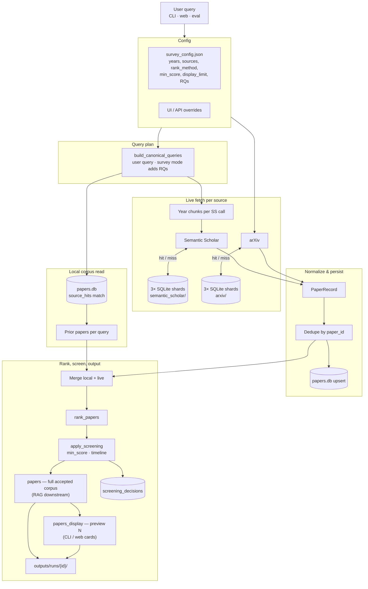

# Pipeline flowchart v4 — 1st baseline (scripted)

Deterministic retrieval — modular `src/` packages, orchestrated by `src/pipeline.py`.

---

## One sentence

User query (+ optional survey config queries) → local corpus + fetch SS & arXiv (raw-cached, year-chunked) → normalize & dedupe → upsert main DB → rank full pool → screen → **full accepted corpus** + **display preview**.

---

## Main flow



---

## Return vs display

| Output | Default | Consumer |
|--------|---------|----------|
| `papers` | All accepted after screening | RAG, artifacts, `--json` |
| `papers_display` | First `display_limit` (10) | Terminal preview, web cards |
| `rejects` | All screened out | Audit / DB |

Rank and screen run on the **full pool**; only the preview is capped.

---

## Storage layout

| Layer | Files | Role |
|-------|-------|------|
| Raw cache | 3× `shard_*.sqlite` per source (6 for SS+arXiv) | Raw API payloads; one shard opened per lookup |
| Corpus | `papers.db` | Normalized merged papers + screening audit |
| History | `history.db` | Web sessions (optional) |

| Command | Purpose |
|---------|---------|
| `python3 -m src.main "topic"` | CLI preview + artifacts |
| `python3 -m src.main "topic" --json` | Full corpus JSON |
| `python3 -m src.main "topic" --survey` | All config queries |
| `python3 -m src.app` | Web UI + `GET /config` filters |
| `python -m src.eval` | 28-query benchmark |

---

## Out of scope (v4)

- Ollama / query rewriting
- OpenAlex (future)
- Single-agent / multi-agent tiers

---

## Module map

```text
src/pipeline.py       run_retrieval()
src/query_builder.py  canonical query list
src/screening.py      accept / reject + reasons
src/fetch.py          SurveyConfig, fetch_all_sources
src/store.py          papers.db + screening_decisions
src/rank.py           SBERT / TF-IDF / recency
```
