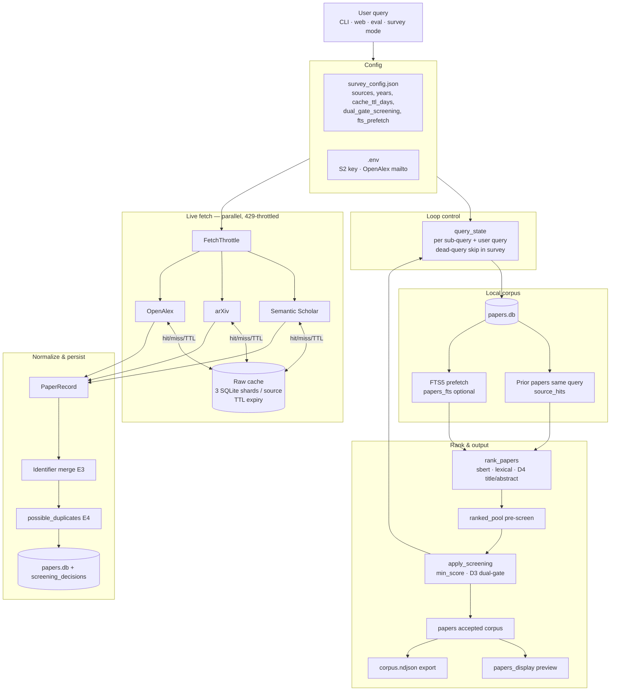

# Pipeline flowchart v5 — 1st baseline (three providers + cache TTL)

Deterministic retrieval: SS + arXiv + **OpenAlex**, sharded SQLite raw cache with **TTL**, FTS cross-query prefetch (optional), fuzzy duplicate flags, full accepted corpus + display preview + NDJSON export.

*(v4 is frozen; v5 supersedes it for current design.)*

---

## One sentence

User query → canonical queries → **same-query local corpus** + optional **FTS cross-query prefetch** → fetch **3 providers in parallel** (429-throttled) → normalize & dedupe → upsert main DB + **fuzzy duplicate flags** → rank (SBERT + lexical + D4 title/abstract SBERT) → screen (min score + optional D3 dual-gate) → **`ranked_pool` + accepted corpus + display preview** → optional **NDJSON export**.

---

## Main flow



---

## v5 feature summary

| Item | Description |
|------|-------------|
| Providers | SS + arXiv + OpenAlex (parallel fetch) |
| Cache | 3 SQLite shards/source + `cache_ttl_days` |
| Output | `ranked_pool` + accepted corpus + display preview + NDJSON |
| Scoring | SBERT primary + lexical secondary + D4 title/abstract SBERT |
| D3 | Optional dual-gate (high SBERT + low lexical → reject) |
| Dedupe E1–E4 | Identifier merge + fuzzy flag |
| G1–G3 | Per-sub-query `query_state` + dead-query skip |
| G4 | FTS5 cross-query prefetch (default off) |
| G5 | `FetchThrottle` on 429 burst |
| Eval | pool / accepted / display target metrics; per-query config |

---

## Config toggles (survey_config.json)

```json
{
  "research_questions": ["..."],
  "query_hints": ["..."],
  "fts_prefetch_enabled": false,
  "fuzzy_dedupe_enabled": true,
  "dual_gate_screening": false,
  "dual_gate_sbert_min": 0.35,
  "dual_gate_lexical_max": 0.15,
  "dual_gate_delta_min": 0.25,
  "dead_query_threshold": 3,
  "rate_limit_threshold": 2
}
```

---

## Entry points

| Command | Purpose |
|---------|---------|
| `python3 -m src.main "topic"` | CLI search |
| `python3 -m src.main "topic" --export ndjson` | Search + NDJSON corpus |
| `python3 -m src.main "topic" --survey` | Multi-query + dead-query skip |
| `python3 -m src.app` | Web UI |
| `python -m src.eval --official` | Reproducible benchmark → `OFFICIAL_BASELINE.json` |
| `python -m src.eval --skip-screening` | Retrieval-only benchmark |

---

## Module map

```text
src/pipeline.py       run_retrieval() — ranked_pool + papers + rejects
src/export.py         NDJSON corpus export
src/eval.py           benchmark + official baseline
src/fetch.py          fetch_all_sources() — parallel + throttle
src/store.py          papers.db, FTS5, possible_duplicates
src/screening.py      accept/reject + D3 dual-gate
src/rank.py           SBERT + lexical + D4 field scores
src/loop_control.py   query_state + dead-query filter
```
