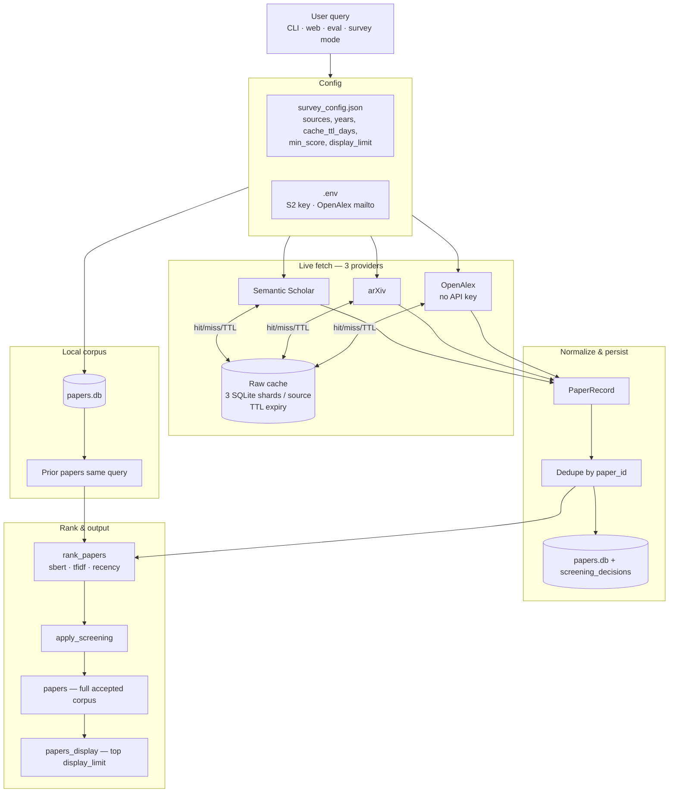

# Pipeline flowchart v5 — 1st baseline (three providers + cache TTL)

Deterministic retrieval: SS + arXiv + **OpenAlex**, sharded SQLite raw cache with **TTL**, full accepted corpus + display preview.

*(v4 is frozen; v5 supersedes it for current design.)*

---

## One sentence

User query → canonical queries → local corpus + fetch **3 providers** (raw-cached with TTL, year-chunked) → normalize & dedupe → upsert main DB → rank → screen → **full accepted corpus** + **display_limit** preview.

---

## Main flow



---

## v5 changes from v4

| Item | v4 | v5 |
|------|----|----|
| Providers | SS + arXiv | SS + arXiv + **OpenAlex** |
| OpenAlex auth | — | **No API key**; optional `OPENALEX_MAILTO` |
| Cache TTL | None | **`cache_ttl_days`** (default 7); lazy delete on read |
| Output | top 10 | **Full accepted corpus** + `display_limit` preview |
| Screening | — | **min_relevance_score** + persisted rejects |
| Query planning | single string | **query_builder** (survey mode) |

---

## Cache TTL

- Config: `"cache_ttl_days": 7` in `survey_config.json` (`0` = never expire).
- On cache **read**: if `created_at` older than TTL → treat as miss, delete row.
- Optional maintenance: `purge_expired_cache()` from `src.cache`.

---

## OpenAlex notes

- Endpoint: `GET https://api.openalex.org/works`
- **No API key.** Free public API.
- Optional `OPENALEX_MAILTO` in `.env` → polite pool (higher rate limits).
- Pagination: cursor-based (`cursor=*`, then `next_cursor` from meta).
- Year filter: `filter=publication_year:YYYY` when year-chunking enabled.
- Abstract: reconstructed from `abstract_inverted_index`.

---

## Entry points

| Command | Purpose |
|---------|---------|
| `python3 -m src.main "topic"` | CLI search |
| `python3 -m src.app` | Web UI |
| `python -m src.eval` | Benchmark |
| `python3 -m src.main --survey` | Config-driven multi-query (if enabled) |

---

## Module map

```text
src/pipeline.py       run_retrieval()
src/fetch.py          fetch_all_sources() — 3 providers
src/sources/openalex.py
src/cache.py          sharded SQLite + TTL
src/screening.py      accept/reject
src/query_builder.py  canonical queries
```
